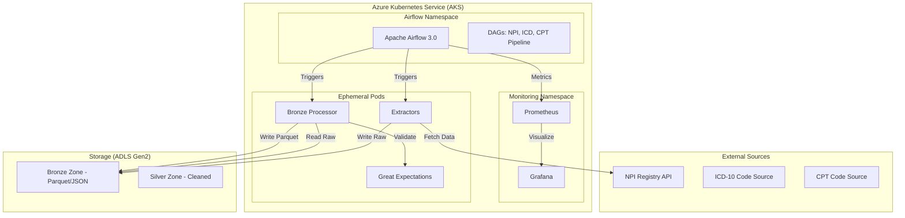

# System Architecture

## Overview
The Healthcare RCM Data Platform is built on a modular, cloud-native architecture using Azure services. It follows the Medallion Architecture pattern for data processing.

## High-Level Architecture Diagram

## Component Details

### 1. Ingestion Layer
- **Extractors**: Containerized Python applications.
- **NPI Extractor**: Fetches data from the NPPES NPI Registry API.
- **ICD/CPT Extractors**: Simulated or API-based extractors for medical codes.
- **Orchestration**: Managed by `KubernetesPodOperator` in Airflow.

### 2. Storage Layer (ADLS Gen2)
- **Bronze**: Raw data in its original format (JSON) and initial Parquet conversion.
- **Silver**: (Planned) Cleaned and standardized data.
- **Gold**: (Planned) Aggregated data for analytics.

### 3. Processing & Quality
- **Bronze Processor**: Converts raw JSON to optimized Parquet format.
- **Data Quality**: Integrated Great Expectations (GX) checkpoints to ensure schema validation and data integrity.

### 4. Observability
- **Prometheus**: Scrapes metrics from Airflow and Kubernetes nodes.
- **Grafana**: Provides real-time dashboards for DAG performance and system health.
- **Alertmanager**: Configured for DAG failure alerts.

### 5. CI/CD
- **GitHub Actions**: Automates linting, Docker builds, and Infrastructure as Code (Terraform) deployments.
